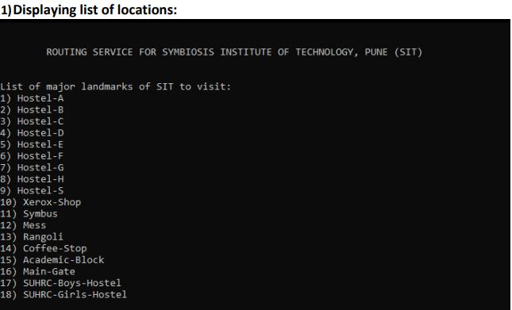

[![LinkedIn][linkedin-shield]][linkedin-url]

<!-- PROJECT LOGO -->
 

  

  <h3 align="center">Route - Guiding you the right way</h3>

  

    A command line implementation of routing services for college
     
     
    ·
    <a href="https://github.com/Himank-J/">Report Bug</a>
    ·
    <a href="https://github.com/Himank-J/">Request Feature</a>
  

<!-- TABLE OF CONTENTS -->
## Table of Contents

* [About the Project](#about-the-project)
  * [Built With](#built-with)
* [Features](#features)
* [Purpose](#purpose)
* [Contributing](#contributing)
* [License](#license)
* [Contact](#contact)

<!-- ABOUT THE PROJECT -->
## About The Project
**NOTE - Kindly refer routing services report for detailed view and details**

 

Routing is the process of selecting a path for traffic in a network, or between or across 
multiple networks. It can be performed in public and private transportation, such as system 
of streets, roads and highways. It involves path selection applying a routing metric to multiple 
routes to select the best route.
  
This project i.e. Routing Services aims to find the minimum distance and routes to the major 
landmarks of Symbiosis Institute of Technology (SIT), Pune. The main targets are the students 
and individuals who are new to the campus and do not know the path to various locations of 
SIT like Hostel, Canteen, Academic Block etc. It also provides a brief description about the 
source and destination that the user has entered.

### Built With
This application is built with love, dedication, coffee and C language

# Features
* A simple menu based code presenting all location names considered for routing
* Easy to use, user just needs to add source location and destination location
* Provides small description of source location as well destination location
* Displays not only smallest path but also shortest distance as part of output
* Locations inside academic block are also considered for routing

<!-- Purpose -->
## Purpose 

 The main idea behind application is to help the visitors, faculties and students to determine 
the shortest path from the entered source to destination in the campus. For the weights 
between the edges we took the coordinates of all the building through google map and 
distance measuring apps.
By having an idea of the positions of all the buildings, a rough graph was created. From the 
rough graph adjacency matrix was created in which all the measured distances were fed.Also using file handling a file was created which contained the information about all the 
locations to help the user get a basic idea about that particular site. So, when the user enters 
the source and destination the information about both the locations is displayed tohim.
The Dijkstra algorithm was then implemented to find the shortest path and distance and 
display it to the user.
If the user selects academic block as his destination, he is given an option whether he wants 
to enter inside the campus and if the answer is “YES” then again, the user is asked for source 
and destination to guide him to his desired location in the short span of time.

<!-- CONTRIBUTING -->
## Contributing

Contributions are what make the open source community such an amazing place to be learn, inspire, and create. Any contributions you make are **greatly appreciated**.

1. Fork the Project
2. Create your Feature Branch (`git checkout -b feature/AmazingFeature`)
3. Commit your Changes (`git commit -m 'Add some AmazingFeature'`)
4. Push to the Branch (`git push origin feature/AmazingFeature`)
5. Open a Pull Request

<!-- LICENSE -->
## License

Distributed under the MIT License. See `LICENSE` for more information.

<!-- CONTACT -->
## Contact

Himank Jain - [callme__hj](https://instagram.com/callme__hj) - My Instagram  
Himank Jain - [himank-jain](https://www.linkedin.com/in/himank-jain/) - My LinkedIn   
Project Link: [https://github.com/Himank-J/Routing-Services](https://github.com/Himank-J/Routing-Services)

<!-- MARKDOWN LINKS & IMAGES -->
<!-- https://www.markdownguide.org/basic-syntax/#reference-style-links -->

[license-shield]: https://img.shields.io/github/license/othneildrew/Best-README-Template.svg?style=flat-square
[license-url]: https://github.com/othneildrew/Best-README-Template/blob/master/LICENSE.txt
[linkedin-shield]: https://img.shields.io/badge/-LinkedIn-black.svg?style=flat-square&logo=linkedin&colorB=555
[linkedin-url]: https://www.linkedin.com/in/himank-jain/
[product-screenshot]: images/search.png
